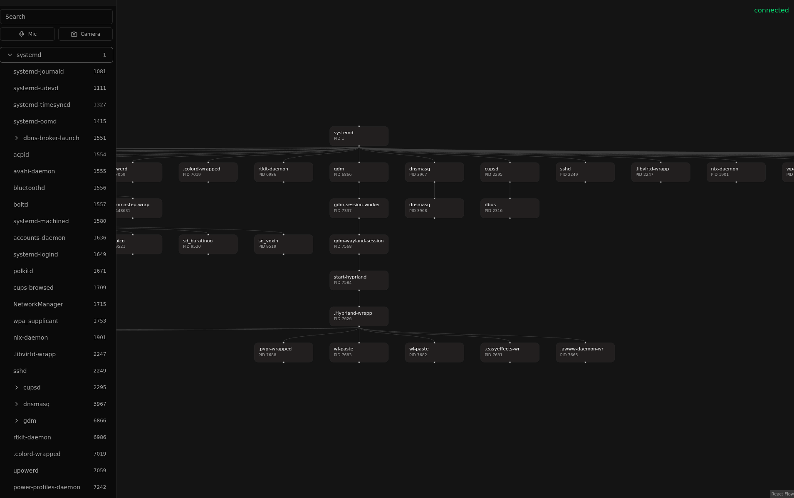

<h3 align="center">Task Manager Reimagined</h2>

Visualization of the process tree

    <a href="docs/getting-started.md">Getting Started</a>
     | 
    <a href="CONTRIBUTING.md">Contributing</a>

# About

Process Visualizer is an electron app to visualize the processes on your machine built using electron and python. If you encounter any bug you are more than welcome to [contribute](/CONTRIBUTING.md).

# Features

## Live process tree

- See a process and its children as an org chart, laid out automatically from top to bottom.
- Each node shows the process name and PID.
- Camera and microphone indicators light up on any process that is using them.

## Process details

- Select a process to open a details panel with its CPU and memory usage.
- See the network connections a process has done.

## Process control

- Suspend and resume a running process.
- Kill a process.
- Controls identify a process by PID and process name, so a reused PID is never hit by mistake.

## Built to stay running

- The UI shows whether the backend is connected and recovers on its own if the backend restarts.
- Reconnects automatically with a growing delay, so a downed backend is not hammered with attempts.

## Local and private

- Runs entirely on your machine. Nothing is sent over the network.
- The app and the backend talk over a Unix socket in your user runtime directory, not an HTTP server.

## Under the hood

| Part           | Built with                                     |
| -------------- | ---------------------------------------------- |
| Backend daemon | Python, `psutil`, `iptc`                       |
| Desktop shell  | Electron (via `electron-vite`)                 |
| Interface      | React, TypeScript, `Tailwind CSS`, `shadcn/ui` |
| Tree view      | `React Flow`, `dagre`                          |
| Backend link   | Unix socket                                    |
